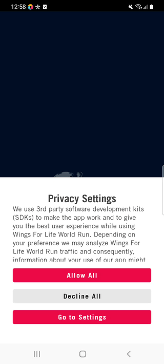

# WFLWR End-to-End QA Automated Testing Project

## Table of Contents

  - [Table of Contents](#table-of-contents)
  - [Introduction](#introduction)
  - [Media](#media)
  - [Installation](#installation)
  - [Scope and Coverage](#scope-and-coverage)
  - [Tech stack and components](#tech-stack-and-components)
  - [License](#license)

## Introduction
The WFLWR Mobile App End-to-End QA Automated Testing Suite is Appium based automation testing suite designed to ensure the quality and reliability of the WFLWR mobile application across both iOS and Android platforms. Shared reusable code, advanced reporting and integration with cloud based testing solutions.

## Media

### Gifs
<p float="left">
  
  
  
</p>

<p float="left">
    
    
</p>

### Demo videos:
...Click on a thumbnail to watch video on YT...
<p float="left">
  <a href="http://www.youtube.com/watch?feature=player_embedded&v=62tcdHnxRwE" target="_blank">
   
  </a>
  <a href="http://www.youtube.com/watch?feature=player_embedded&v=f5UV3uHKCR8" target="_blank">
   
  </a>
</p>

## Installation

1. clone this repository:

    ```
    git clone https://github.com/ozzychel/wflwr_appium_test_suite.git
    ```

2. go to /wflwr_appium_test_suite folder:

    ```
    cd wflwr_appium_test_suite
    ```

3. install dependencies:

    ```
    npm install
    ```

4. run demo script:
    ```
    npm run demo
    ```

## Scope and Coverage

#### 1. Consent Management and Cookie Settings
  * Test the display and functionality of cookie consent pop-ups or banners.
  * Validate the acceptance or rejection of cookies and the subsequent behavior of the app.
  * Verify that the app complies with the specified cookie consent requirements.

#### 2. User Sign Up / Sign In (email flow)
  * Test the user registration process, including input validation, account creation, and email verification.
  * Validate user authentication and login functionality, ensuring secure access to user accounts.
  * Verify that the registration screens are displayed correctly and consistently across different devices and screen sizes.
  * Check for proper alignment, spacing, and visibility of all UI elements (e.g., text fields, buttons, labels, checkboxes).
  * Validate that error messages and validation feedback are displayed accurately and in a user-friendly manner.
  * Ensure the UI follows design guidelines and best practices for mobile applications.

#### 3. Permissions (location, audio, battery)
  * Test the app's behavior when accessing device permissions, such as location, battery optimization or audio settings.
  * Verify proper handling of permission requests and the app's response to user choices.
  * Validate that the app functions correctly with both granted and denied permissions (TBD)

#### 4. Race Day registration
  * Test functionality of Race day registration user flow with a focus on validation of user inputs and form submissions
  * Check of consistent alignment and visibility of all UI elements
  * Test the end-to-end registration flow, including entering personal information, payment options, and any additional steps involved.

#### 5. Basic Navigation
  * Verify smooth transitions between different screens, tabs, and menus.
  * Validate the correct display of navigation elements and their functionality.
  * Test navigation flow within the app, ensuring users can seamlessly navigate through different sections.

#### 6. User Profile and Settings
  * Validate user profile creation and update functionality, including fields such as name, email, and profile picture.
  * Test customization of user preferences, such as language selection, theme settings, and notification preferences.
  * Verify the ability to modify and save user settings, ensuring changes are properly reflected.

#### 7. Deep Linking (TBD)
  * Test the app's deep linking functionality, ensuring proper handling of external links or URLs.
  * Validate that deep links correctly navigate to specific screens or content within the app.
  * Verify the app's behavior when launched through different deep link scenarios

#### 8. Meetup and community (TBD)
#### 9. Teams (TBD)
#### 10. Edge cases / Error handling (TBD)

## Tech stack and components
#### 1. Appium:
   Appium serves as the core tool for automating interactions with the WFLWR mobile app.
   It provides cross-platform support, allowing the suite to automate tests for both Android and iOS devices.
   Appium enables the suite to interact with the app's user interface elements, simulate user actions, and retrieve app state information.
#### 2. WebDriverIO (WDIO) with TypeScript:
   WebDriverIO, combined with TypeScript, is the chosen test automation framework for building and executing tests in the WFLWR testing suite.
   TypeScript, a statically-typed superset of JavaScript, enhances code reliability and maintainability.
   WDIO provides a wide range of powerful APIs and utilities for interacting with the app, making assertions, and managing test flows.
#### 3. Test Data Management:
   The suite employs efficient test data management techniques to ensure comprehensive test coverage.
   Test data can be managed through custom approaches or test data generation tools, allowing for a variety of test scenarios and inputs during test execution.
#### 4. Reporting and Analytics:
   The suite incorporates robust reporting and analytics capabilities to provide insights into test execution and results.
   WDIO's built-in reporting features, combined with custom reporting plugins or frameworks, enable the generation of detailed test reports with informative visuals.
   These reports facilitate analysis of test outcomes, allowing the team to identify failures, errors, and overall test status.
#### 5. Continuous Integration (CI):
   The suite seamlessly integrates with CI platforms such as Jenkins or CircleCI to enable automated test execution as part of the CI/CD pipeline.
   CI integration ensures that tests are automatically triggered on code changes or scheduled intervals, providing continuous feedback on the app's stability and quality.

The WFLWR Mobile App End-to-End QA Automated Testing Suite is designed primarily for real device usage, ensuring the accuracy and reliability of test results. Although it can be run on simulators as well, the suite is specifically optimized for testing on real devices. By focusing on real device usage, the suite accounts for variations in hardware, operating systems, and device-specific behaviors, providing a more realistic and comprehensive testing approach.

## License
[MIT](https://choosealicense.com/licenses/mit/)
